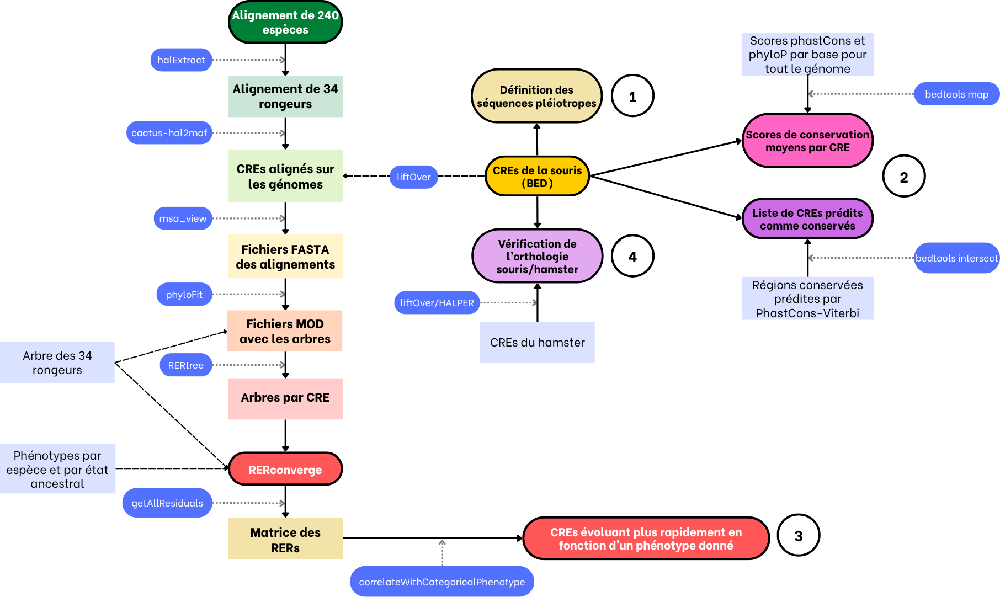
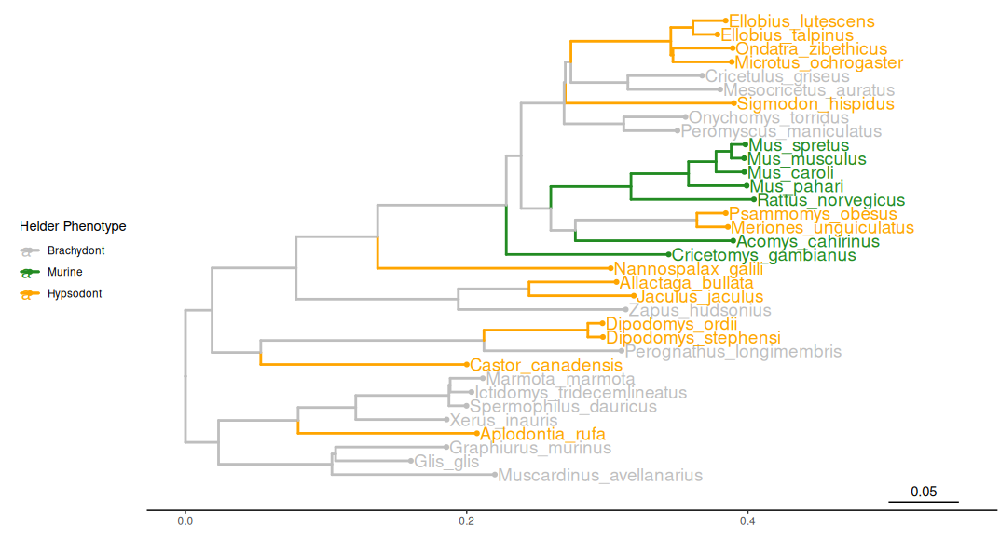

### Jérémy CARON - CIGOGNE Team, LBMC, ENS de Lyon

Pipeline created for the M2 internship on pleiotropy and rhythms of evolution for cis-regulatory regions in upper and lower rodents molars.
It needs as input: 
- A whole genome alignment in HAL format
- A list of cis-regulatory sequences in BED format for two species
- A list of conservation scores (PhastCons and/or PhyloP) for each base of a given genome; and a list of conserved regions predicted by the phastCons-Viterbi algorithm

Here, the whole genome alignment was fetched from Zoonomia (https://cglgenomics.ucsc.edu/data/cactus/). The BED files were produced by the CIGOGNE team, and were sequences of the mouse and hamster. The conservation scores come from the data of Michaël Dong, researcher at Uppsala University and member of the Zoonomia Consortium. The PhastCons/PhyloP pipeline can be found here: https://github.com/michaeldong1/ZOONOMIA/tree/main/UppmaxSlurm_version.

------------
# Pipeline



------------
# Repository structure
The scripts are ordered by language, and by parts of the analysis. Some files are used multiple times in different parts, see below for details. 
The codes are formatted to be used with SLURM in the CBPsmn cluster of the ENS de Lyon. 

.\
├── Images \
│   ├── pipeline.png \
│   └── tree.png \
├── README.md \
└── src \
    ├── pipelines \
    │   ├── alignment_pipeline \
    │   │   ├── 0-src_halExtract.sh \
    │   │   ├── 1-src_hal2maf.sh \
    │   │   ├── 2-src_msa_view.sh \
    │   │   ├── 3-src_phyloFit.sh \
    │   │   └── 4-src_RERtree.sh \
    │   └── misc \
    │       ├── conversion.sh \
    │       ├── format.sh \
    │       └── hal2fasta.sh \
    ├── python_scripts \
    │   ├── best_summit_per_cre.py \
    │   ├── id_matrix.py \
    │   ├── id_ref.py \
    │   └── merge_msa_by_region.py \
    ├── Rscripts \
    │   ├── identity_matrix.Rmd \
    │   ├── plot_phylo.Rmd \
    │   ├── rerconverge.Rmd \
    │   └── scores.Rmd \
    └── slurmjobs \
        ├── alignment_pipeline \
        │   ├── 0_halExtract.sh \
        │   ├── 1_hal2maf.sh \
        │   ├── 2_msa_view.sh \
        │   ├── 3_phyloFit_command.sh \
        │   ├── 3_phyloFit.sh \
        │   ├── 3_phyloFit_summary.sh \
        │   └── 4_RERtree.sh \
        ├── HALPER_pipeline \
        │   ├── halliftover_job.sh \
        │   └── HALPER_pipeline.sh \
        ├── misc \
        │   ├── slurm_conv.sh \
        │   └── slurm_hal2fasta.sh \
        └── PHAST_pipeline \
            ├── coverage.sh \
            ├── phastcons_v2.sh \
            └── phyloP_v2.sh

13 directories, 33 files

------------

# Rodent tree



------------

## First steps to use the code

- get the Zoonomia alignment

 ```bash
wget https://cgl.gi.ucsc.edu/data/cactus/447-mammalian-2022v1.hal -O zoonomia.hal 
 ```

- Format the BED file including the cis-regulatory sequence information (skip if the BED file is already in good shape)

```bash
./format.sh {bedfile}
```
- Liftover the regulatory regions to the genome version used in the Zoonomia alignment

```bash
sbatch src/slurmjobs/misc/slurm_conv.sh
```

The workflow is then separated in four parts, each using different scripts.

# A. Determining and quantifying sequence pleiotropy

Code used: ```src/Rscripts/scores.Rmd```. \
The script was executed in RStudio, on a local machine. 

# B. Measuring sequence conservation

Code used: 
```bash
#Compute the mean conservation scores for each cis-regulatory region
sbatch src/slurmjobs/alignment_pipeline/phastcons_v2.sh
sbatch src/slurmjobs/alignment_pipeline/phyloP_v2.sh

#Get the cis-regulatory regions predicted as conserved
sbatch src/slurmjobs/alignment_pipeline/coverage.sh
```
The rest of the analysis was done with ```src/Rscripts/scores.Rmd``` on a local machine with RStudio.

# C. Measuring relative evolutionary rates for each sequence

Code used: 
```bash
#Extract the 34-species alignment from the 240-species Zoonomia alignment
#Optional if you don't need to extract a subset of species in your analysis
sbatch src/slurmjobs/alignment_pipeline/0_halExtract.sh

#Align the regulatory regions on the HAL file
sbatch src/slurmjobs/alignment_pipeline/1_hal2maf.sh

#Get a FASTA file of each sequence's alignment
sbatch src/slurmjobs/alignment_pipeline/2_msa_view.sh

#Check the identity of one sequence
python3 src/python_scripts/id_ref.py {fasta_path} {reference_sp}

#Check the identity of each sequence
python3 src/python_scripts/id_matrix.py {fasta_repo} 

#Adjust a REV model to each FASTA file
bash src/slurmjobs/alignment_pipeline/3_phyloFit.sh

#Concatenate all sequence trees in a single file for RERconverge analysis
sbatch src/slurmjobs/alignment_pipeline/4_RERtree.sh
```
The rest of the analysis was done with ```src/Rscripts/rerconverge.Rmd``` on a local machine with RStudio.

# D. Checking sequence orthology

Code used: 
```bash
#Get the best summit from MACS2-predicted summits of each cluster
python3 src/python_scripts/best_summit_per_cre.py --cres --summit --out --strategy

#Run the main HALPER pipeline
bash src/slurmjobs/HALPER_pipeline/HALPER_pipeline.sh
```

The other scripts present in this repository are used in other files, notably most of the scripts found in the ```pipelines``` repositories are used in their corresponding SLURM jobs. 
